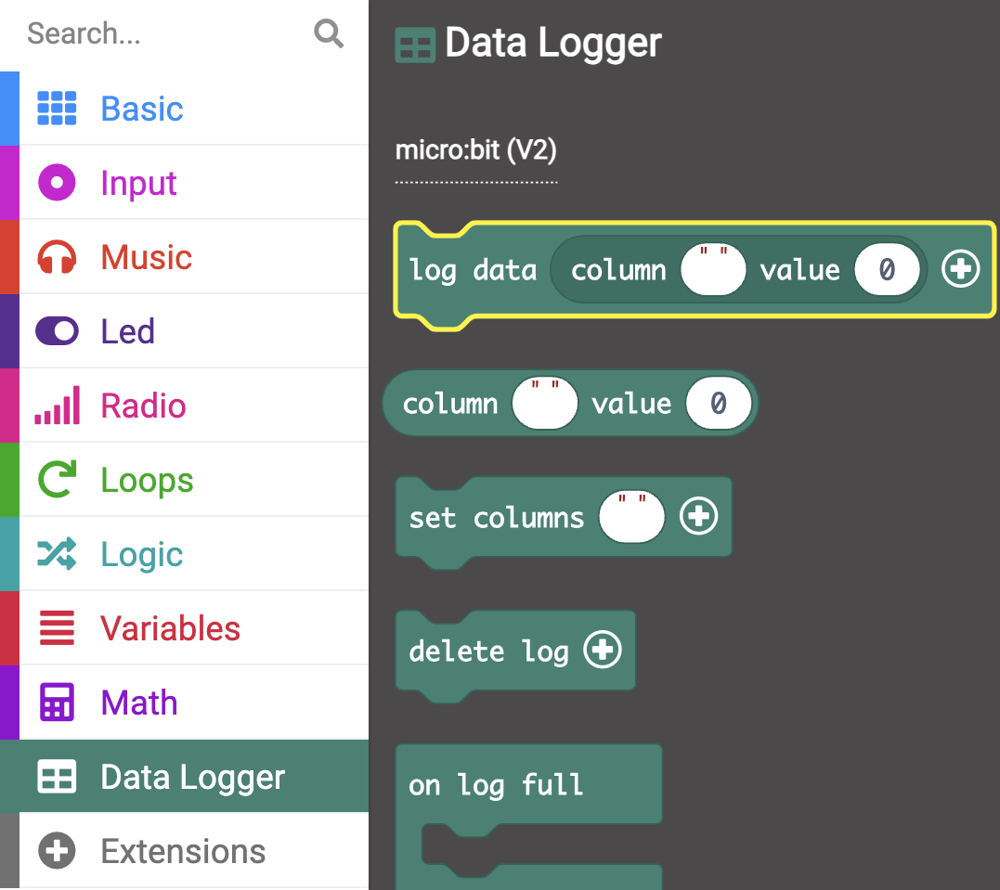

You can store (log) data to your micro:bit V2 that will still be there after you unplug the power. This is not the case with data stored using variables.

In this example, data from the microphone is logged.

```microbit
loops.everyInterval(500, function () {
    led.plotBarGraph(
    input.soundLevel(),
    255
    )
    datalogger.log(datalogger.createCV("Sound level", input.soundLevel()))
})
```

You will need to install an extension to use the `Data Logger`{:class='microbitdatalogger'}.

On the menu panel, click on **Extensions**. Another window will open showing recommended extensions. 

Click on the **data logger** and it will be installed as a menu item.


You can find a `log data`{:class='microbitdatalogger'} block inside the `Data Logger`{:class='microbitdatalogger'} menu.



Place the `log data`{:class='microbitdatalogger'} block inside an event block or a loop block. The `every`{:class='microbitloops'} block has been used in this example.

```microbit
loops.everyInterval(500, function () {
    datalogger.log(datalogger.createCV("", 0))
})
```

You need to label your column field with a useful name for your data. In this example, the column has been labelled `Sound Level`.

```microbit
loops.everyInterval(500, function () {
    datalogger.log(datalogger.createCV("Sound level", 0))
})
```

You also need to add the input sensor that will be logged into the value field of the `log data`{:class='microbitdatalogger'} block.

In this example, the `sound level`{:class='microbitinput'} block which can be found in the `Input`{:class='microbitinput'} menu has been used.

```microbit
loops.everyInterval(500, function () {
    datalogger.log(datalogger.createCV("Sound level", input.soundLevel()))
})
```

You can view the data logged on your micro:bit by plugging it into your computer and opening the data file. 

You can add more than one sensor to be logged on the same `log data`{:class='microbitdatalogger'} block. 

### Logging data for V1 users

If you are using a micro:bit V1, you can only log data using two micro:bits. One transmits the data using the radio and the other receives this data.

Take a look at this [project from micro:bit to help you log data on the V1](https://microbit.org/projects/make-it-code-it/makecode-wireless-data-logger/#sensor-/-transmitter){:target="_blank"}
