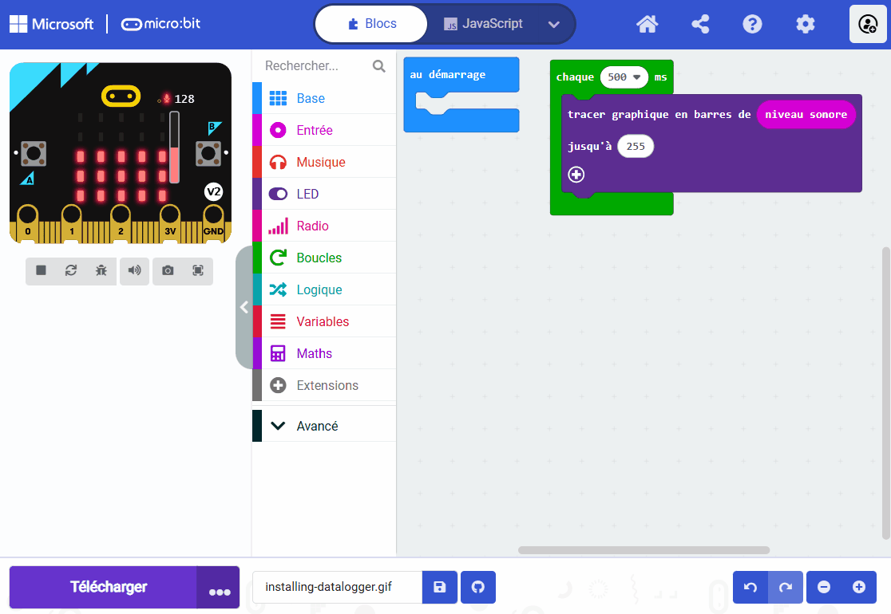
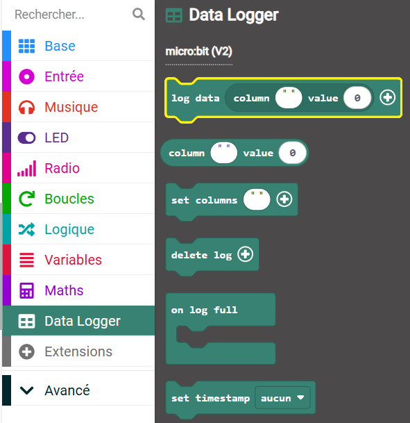

Tu peux stocker (enregistrer) des données sur ton micro:bit V2 afin qu'elles soient toujours là après avoir débranché l'alimentation. Ce n’est pas le cas avec les données stockées à l’aide de variables.

Dans cet exemple, les données du microphone sont enregistrées.

```microbit
loops.everyInterval(500, function () {
    led.plotBarGraph(
    input.soundLevel(),
    255
    )
    datalogger.log(datalogger.createCV("Sound level", input.soundLevel()))
})
```

Tu devras installer une extension pour utiliser le `Data Logger`{:class='microbitdatalogger'}.

Dans le panneau de menu, clique sur **Extensions**. Une autre fenêtre s'ouvrira affichant les extensions recommandées.

Clique sur le \*\*data logger et il sera installé en tant qu'élément de menu.



Tu peux trouver un bloc `log data`{:class='microbitdatalogger'} dans le menu `Data Logger`{:class='microbitdatalogger'}.



Place le bloc `log data`{:class='microbitdatalogger'} à l'intérieur d'un bloc événement ou d'un bloc boucle. Le bloc `chaque`{:class='microbitloops'} a été utilisé dans cet exemple.

```microbit
loops.everyInterval(500, function () {
    datalogger.log(datalogger.createCV("", 0))
})
```

Tu dois nommer ton champ de colonne avec un nom utile pour tes données. Dans cet exemple, la colonne a été nommée `Niveau sonore`.

```microbit
loops.everyInterval(500, function () {
    datalogger.log(datalogger.createCV("Sound level", 0))
})
```

Tu dois également ajouter le capteur d'entrée qui sera enregistré dans le champ de valeur du bloc `log data`{:class='microbitdatalogger'}.

Dans cet exemple, le bloc `niveau sonore`{:class='microbitinput'}, qui se trouve dans le menu `Entrée`{:class='microbitinput'}, a été utilisé.

```microbit
loops.everyInterval(500, function () {
    datalogger.log(datalogger.createCV("Sound level", input.soundLevel()))
})
```

Tu peux voir les données enregistrées sur ton micro:bit en le branchant sur ton ordinateur et en ouvrant le fichier de données.

Tu peux ajouter plusieurs capteurs à enregistrer dans le même bloc `log data`{:class='microbitdatalogger'}.

### Enregistrement des données pour les utilisateurs V1

Si tu utilises un micro:bit V1, tu ne peux enregistrer des données qu'à l'aide de deux micro:bits. L'un transmet les données par radio et l'autre reçoit ces données.

Jette un œil à ce [projet micro:bit pour t'aider à enregistrer les données sur le V1](https://microbit.org/projects/make-it-code-it/makecode-wireless-data-logger/#sensor-/-transmitter){:target="_blank"}.
