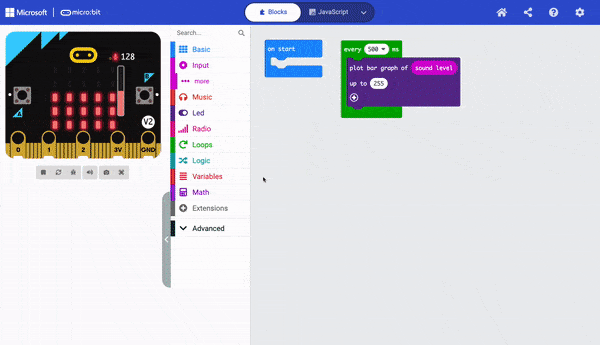

Je kunt (log) gegevens opslaan naar je micro:bit V2, zodat deze behouden blijven nadat je de stroom loskoppelt. Dit is niet het geval bij gegevens die zijn opgeslagen met behulp van variabelen.

In dit voorbeeld worden gegevens van de microfoon geregistreerd.

```microbit
loops.everyInterval(500, function () {
    led.plotBarGraph(
    input.soundLevel(),
    255
    )
    datalogger.log(datalogger.createCV("Sound level", input.soundLevel()))
})
```

Je moet een extensie installeren om de `Data Logger`{:class='microbitdatalogger'} te kunnen gebruiken.

Klik in het menupaneel op **Uitbreidingen**. Er wordt een ander venster geopend met de aanbevolen extensies.

Klik op de **data logger** en het zal worden geïnstalleerd als menu-item.



Je kunt een `log data`{:class='microbitdatalogger'} blok vinden in het `Data Logger`{:class='microbitdatalogger'} menu.


Plaats het `log data`{:class='microbitdatalogger'} blok in een gebeurtenisblok of een lusblok. Het `elk (ms)`{:class='microbitloops'} blok is in dit voorbeeld gebruikt.

```microbit
loops.everyInterval(500, function () {
    datalogger.log(datalogger.createCV("", 0))
})
```

Je moet het kolomveld een label geven met een handige naam voor je gegevens. In dit voorbeeld heeft de kolom het label 'Geluidsniveau' gekregen.

```microbit
loops.everyInterval(500, function () {
    datalogger.log(datalogger.createCV("Sound level", 0))
})
```

Je moet ook de invoersensor toevoegen die wordt geregistreerd in het waardeveld van het `log data`{:class='microbitdatalogger'} blok.

In dit voorbeeld is het blok `geluidsniveau`{:class='microbitinput'} gebruikt, dat te vinden is in het menu `Invoer`{:class='microbitinput'}.

```microbit
loops.everyInterval(500, function () {
    datalogger.log(datalogger.createCV("Sound level", input.soundLevel()))
})
```

Je kunt de op je micro:bit vastgelegde data bekijken door deze aan je computer te koppelen en het data bestand te openen.

Je kunt meer dan één sensor toevoegen om gegevens in hetzelfde `log data`{:class='microbitdatalogger’} blok vast te leggen.

### Gegevensregistratie voor V1 gebruikers

Als je een micro:bit V1 gebruikt, kun je alleen gegevens registreren met twee micro:bits. De ene zendt de gegevens via de radio en de andere ontvangt deze gegevens.

Bekijk dit [project van micro:bit om je te helpen gegevens te registreren op de V1](https://microbit.org/projects/make-it-code-it/makecode-wireless-data-logger/#sensor-/-transmitter){:target="\_blank"}.
